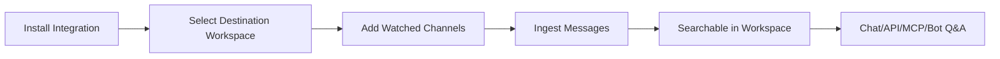
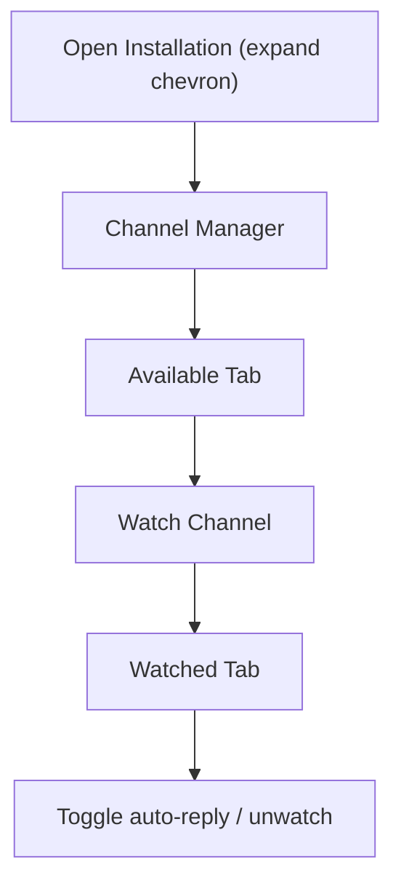

Connect chat platforms and continuously sync channel history into Ragora workspaces.

## Message Sync Pipeline

---

## Platform Availability

### Available in current dashboard install cards
- Discord
- Slack

### Implemented server-side but not currently shown in install cards
- Telegram

Use this page for ingestion/sync controls. Q&A answer behavior is covered in [Q&A Bots](/docs/bots/qa-bots).

---

## Installation Flow

1. Go to **Integrations** → **Bot Integrations** <a className="btn-inline" href="https://ragora.app/integrations?tab=bots">Bot Integrations &rarr;</a>
2. Select a destination workspace from the dropdown in the connect area
3. Click the platform card (Discord or Slack) to begin the OAuth flow
4. Complete OAuth on the platform
5. Return to the bot list
6. Click the expand chevron on the bot card to open the channel manager
7. Add channels from **Available** into **Watched**

After this, watched channels begin contributing synced content.

---

## Channel Manager Workflow

---

## Channel-Level Controls

### Available in the Dashboard UI

| Control | Effect |
|---------|--------|
| **Auto-reply toggle** | Enable/disable automatic bot responses for the channel |
| **Unwatch** (X button) | Stop watching the channel; moves it back to Available |

### API/Server-Side Only

The following settings exist at the data model level but are **not** configurable through the dashboard UI:

| Setting | Values | Effect |
|------|--------|--------|
| `sync_mode` | `all_messages`, `solved_only`, `manual` | Controls sync granularity |
| `is_active` | `true` / `false` | Pause/resume channel sync without removing config |

All watched channels default to `sync_mode = all_messages`. To change sync mode, use the API directly.

---

## Bot Installation Scope Settings

| Setting | Values | Purpose |
|------|--------|---------|
| `collection_id` | workspace UUID | Destination for synced messages (configurable via workspace dropdown on bot card) |
| `collection_mode` | `single`, `all` | Retrieval scope used at answer time (API-only, not configurable in dashboard UI) |

`collection_mode` behavior:
- `single`: use configured destination workspace scope
- `all`: use all accessible workspaces for broader retrieval

---

## Data Model Reference (Operational)

### Installation

| Field | Meaning |
|------|---------|
| `platform` | `discord`, `slack` (and `telegram` server-side) |
| `status` | installation state (`active`, `paused`, `error`, `disconnected`) |
| `collection_id` | destination workspace |
| `collection_mode` | `single` or `all` |
| `last_sync_at` | last successful sync timestamp |

### Watched Channel

| Field | Meaning |
|------|---------|
| `channel_id` | provider channel identifier |
| `channel_name` | display name |
| `channel_type` | e.g. `text`, `forum`, `thread`, `dm` |
| `sync_mode` | channel ingest mode |
| `is_active` | paused/active flag |
| `message_count` | synced message count |

---

## Sync Mode Selection Guide (API-Only)

These modes are set via the API, not the dashboard UI. All watched channels default to `all_messages`.

| Mode | Choose when | Tradeoff |
|------|-------------|----------|
| `all_messages` | You want complete historical capture (default) | Higher volume/noise |
| `solved_only` | Support channels and resolved-thread use cases | Lower noise, may miss unsolved context |
| `manual` | Temporary pause or explicit control | No ongoing sync contribution |

---

## Operational Controls Available in UI

From bot cards and channel manager:

- Connect/disconnect bot installation
- Pause/resume installation
- Open channel manager (expand chevron on bot card)
- Add watched channels
- Remove (unwatch) channels
- Toggle per-channel auto-reply setting

---

## Downstream Surfaces That Use Synced Messages

Synced messages become retrievable through:

- Workspace chat interface
- Retrieval API
- Chat Completions API
- MCP tools
- Bot Q&A responses

---

## Recommended Deployment Patterns

These patterns reference `sync_mode` and `collection_mode`, which are API-level settings (not configurable in the dashboard UI).

### Pattern A: Support Archive

- Destination: dedicated support workspace
- Channels: support forums/help channels
- Sync mode (API): `solved_only`
- Collection mode (API): `single`

### Pattern B: Team Memory

- Destination: team operations workspace
- Channels: engineering/ops channels
- Sync mode (API): `all_messages` for key channels; unwatch noisy channels
- Collection mode (API): `all` for broader context

### Pattern C: Hybrid

- Keep core docs in one collection
- Keep chat history in another
- Use `collection_mode: all` (API) only when required by answer coverage

---

## Monitoring Checklist

Weekly checks:

1. Confirm installations remain `active`
2. Confirm watched channels still match intended scope
3. Review message count growth
4. Identify noisy channels and unwatch them if needed
5. Validate answer quality in workspace chat with same scope

---

## Troubleshooting

### No channels in **Available**

Check:
- OAuth/install completed
- bot/app has access to target workspace/server
- your user can view channels in provider

### Channel appears but does not sync

Check:
- channel added to **Watched**
- bot installation is not paused
- bot has access to the channel on the platform

### Sync quality is noisy

Try:
- unwatch noisy channels to stop syncing them
- narrow the watched channel set to high-signal channels

### Bot answers miss expected chat knowledge

Check:
- messages actually synced to destination workspace
- relevant channels are watched
- if using API: verify `collection_mode` matches expected answer scope

### Installation health degraded over time

Try:
- pause/resume installation
- verify provider-side membership/permissions
- reinstall integration if provider tokens/scopes changed
