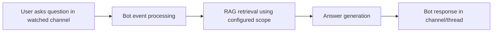
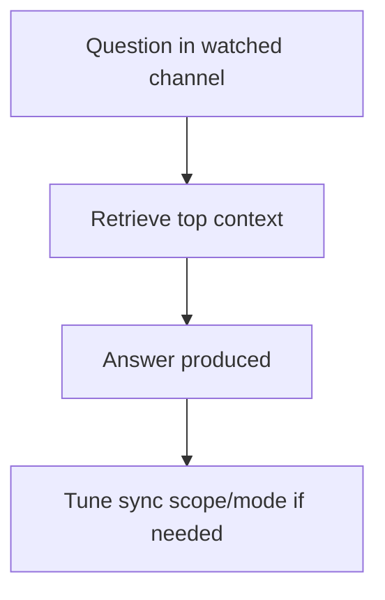

Use Ragora bots to answer questions directly in chat channels using your synced workspaces.

## Q&A Runtime Architecture

---

## Supported Platforms in Dashboard

- Discord
- Slack

Server-side note:
- Telegram support paths exist in backend, but Telegram is not currently exposed in the dashboard install cards.

---

## Quick Setup for First Bot Answer

1. Install bot from **Integrations** → **Bot Integrations** (`/integrations?tab=bots`)
2. Set destination workspace
3. Add watched channels
4. Ensure channels are active
5. Send a test query in a watched channel
6. Validate response quality

For channel sync configuration details, see [Message Sync Integrations](/docs/bots/message-sync).

---

## How Retrieval Scope Affects Answers

| Setting | Values | Effect |
|------|--------|--------|
| `collection_mode` | `single`, `all` | Defines retrieval scope used for responses |
| `collection_id` | destination workspace UUID | Primary scope target when mode is `single` |

**Note:** `collection_mode` is an API-level setting and is not configurable through the dashboard UI. The destination workspace (`collection_id`) can be changed via the workspace dropdown on the bot card.

### Scope strategy

- Use `single` when a bot should answer from one bounded knowledge area.
- Use `all` when broader cross-workspace answer coverage is needed.

---

## Channel Configuration Impact on Bot Accuracy

| Channel configuration | Q&A impact |
|----------------------|------------|
| `sync_mode = all_messages` (default) | Broadest recall; can increase irrelevant context |
| `sync_mode = solved_only` (API-only) | Better signal for support-style Q&A |
| `sync_mode = manual` (API-only) | Minimal/no new channel context for answers |
| Channel unwatched | Channel stops contributing updated context |

Forum behavior:
- `auto_reply_on_forum_post` can change how responses are posted for forum posts.

---

## Q&A Interaction Model

Common usage pattern:

1. User asks in watched channel
2. Bot performs retrieval over configured scope
3. Bot returns grounded response
4. Team iterates channel/scope configuration for quality tuning

---

## Best Practices

1. Start with a small, high-signal channel set.
2. Prefer `solved_only` for support forums.
3. Keep core documentation ingested in the same retrieval scope.
4. Use workspace chat to benchmark expected answers before full rollout.
5. Use dedicated workspaces when teams/domains are very different.

---

## Rollout Checklist

Before broad rollout:

- Bot installation status is `active`
- Required channels are watched
- Destination workspace has recent synced data
- If using the API: `collection_mode` matches intended assistant behavior

After rollout:

- Review low-quality answers weekly
- Prune noisy channels
- Rebalance `single` vs `all` scope based on misses

---

## Troubleshooting Matrix

| Symptom | Likely cause | Fix |
|------|--------------|-----|
| Bot installed but silent | Channel not watched | Add to watched, ensure bot is not paused |
| Answers miss obvious chat context | Wrong workspace scope | Verify destination workspace; check `collection_mode` via API |
| Answers too noisy/off-topic | Overly broad ingestion | Unwatch noisy channels |
| Channels missing from picker | Provider permissions/membership | Recheck provider install and permissions |
| Behavior changed suddenly | Provider access drift or config drift | Revalidate installation, review channel settings |

---

## Example Operating Profiles

### Support Bot

- Watched channels: support forums
- Sync mode (API): primarily `solved_only`
- Collection mode (API): `single`
- Goal: consistent, precise support answers

### Team Knowledge Bot

- Watched channels: engineering + ops
- Sync mode (API): mixed (`all_messages` for key channels, unwatch noisy ones)
- Collection mode (API): `all`
- Goal: broad historical recall across teams

### Mixed Product/Support Bot

- Chat channels plus product docs collection
- Start with `single` collection mode (API) and expand if needed
- Tune based on observed misses and false positives

---

## Related Docs

- [Message Sync Integrations](/docs/bots/message-sync)
- [Cloud Connectors](/docs/integrations/connectors)
- [Getting Started](/docs/getting-started)
