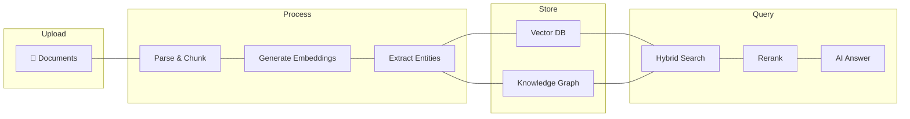
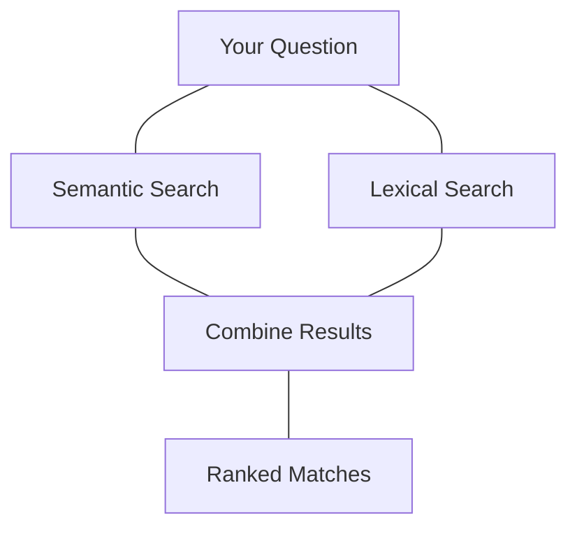
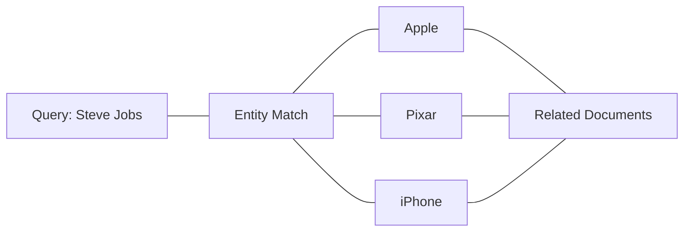

Ragora transforms your documents into an AI-ready workspace with advanced retrieval.

## The Pipeline

**Upload → Process → Store → Query with precision**

---

## 1. Document Ingestion

When you upload documents or connect data sources, Ragora processes them through a multi-stage pipeline:

| Stage | What Happens |
|-------|--------------|
| **Parse** | Extract text from PDFs, DOCX, and 50+ formats; transcribe audio/video via AI |
| **Chunk** | Split into semantic passages with CJK-aware sizing |
| **Embed** | Generate dense vectors (multilingual, 100+ languages) + sparse BM25 |
| **Extract** | Identify entities (people, orgs, products) for GraphRAG |

### Supported Formats

- **Documents:** PDF, DOCX, TXT, Markdown, Excel, PowerPoint, and 50+ more file types
- **Media:** MP3, WAV, MP4, WEBM (transcribed via AI)
- **Images:** With OCR support for text extraction
- **Code:** GitHub repos, markdown documentation
- **Chat:** Discord, Slack channels

---

## 2. Hybrid Search

When you query, Ragora combines two search methods for optimal results:

| Method | Default Weight | Finds |
|--------|----------------|-------|
| **Semantic (Dense)** | 75% | Meaning, context, synonyms |
| **Lexical (Sparse)** | 25% | Exact keywords, error codes, IDs |

This hybrid approach catches both conceptual matches and exact terms.

---

## 3. Knowledge Graph (GraphRAG)

Entities extracted during ingestion power contextual expansion:

- **During ingestion:** We extract people, companies, products, concepts
- **At query time:** Your query entities expand to related entities
- **Result:** Find relevant docs even without exact keyword matches

---

## 4. Cross-Encoder Reranking

After initial retrieval, a cross-encoder model scores each result against your exact query:

| Step | What Happens |
|------|--------------|
| **1. Fast fetch** | Bi-encoder retrieves 100+ candidates quickly |
| **2. Deep scoring** | Cross-encoder scores each against your question |
| **3. Top results** | Only the most relevant 10 reach the LLM |

This filtering ensures high-quality context for answer generation.

---

## 5. Answer Generation

The top-ranked passages are sent to an LLM with your question:

- **Grounded responses:** AI answers based on your actual documents
- **Source citations:** Every answer includes clickable references
- **Streaming:** Real-time SSE streaming for chat responses
- **OpenAI-compatible:** Drop-in replacement for existing apps

---

## Why This Matters

| Problem | Ragora Solution |
|---------|-----------------|
| AI makes things up | Multi-layer verification grounds answers in docs |
| Keyword search misses context | Hybrid semantic + lexical catches both |
| Related info scattered | Knowledge graph connects topics automatically |
| Irrelevant results waste context | Cross-encoder reranking filters noise |

**Result:** Answers are grounded in your actual documents with high faithfulness, thanks to multi-layer retrieval and reranking.

---

## Multilingual Support

Ragora supports content in **100+ languages** out of the box. No configuration needed — upload documents in any language and search across them seamlessly.

| Capability | How It Works |
|------------|-------------|
| **Multilingual ingestion** | Upload and process documents in any language — English, Chinese, Japanese, Korean, Arabic, Hindi, Nepali, European languages, and more |
| **Cross-language retrieval** | Query in one language and find relevant results from documents written in another |
| **CJK-aware chunking** | Smart text splitting handles Chinese, Japanese, and Korean character boundaries correctly |
| **Multilingual reranking** | Cross-encoder reranker scores relevance accurately across languages |

### Supported Language Families

- **European:** English, Spanish, French, German, Italian, Portuguese, Dutch, Polish, Russian, and more
- **East Asian:** Chinese (Simplified & Traditional), Japanese, Korean
- **South Asian:** Hindi, Nepali, Bengali, Tamil, Telugu, Urdu
- **Middle Eastern:** Arabic, Hebrew, Turkish, Persian
- **Southeast Asian:** Thai, Vietnamese, Indonesian, Malay
- **And many more** — any language supported by our multilingual embedding model

### Cross-Language Search

Because Ragora uses multilingual embeddings, your queries work across language boundaries:

- Ask in English, find results from Japanese documents
- Search in Spanish, retrieve relevant Chinese content
- Mix languages in queries naturally — the embeddings understand meaning, not just words

---

## Technology Stack

| Component | Technology |
|-----------|------------|
| **Embeddings** | Multilingual dense embeddings (100+ languages) |
| **Sparse** | BM25 lexical search |
| **Vector DB** | Qdrant with hybrid search |
| **Reranker** | Cross-encoder reranker |
| **LLM** | Configurable per organization |
| **Processing** | Async priority queues |
