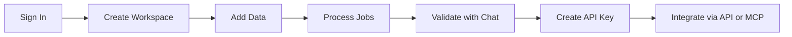

This guide walks from empty account to a production-ready first retrieval flow.

## End-to-End Flow



---

## Quick Start

1. Sign in at [ragora.app](https://ragora.app)
2. Create a workspace in **Workspaces**
3. Add data from your workspace detail page
4. Wait for ingestion jobs to complete
5. Validate answers using the **Knowledge Playground**
6. Create API keys in **Settings** → **API Keys**

---

## Step 1: Sign In

1. Visit [ragora.app](https://ragora.app)
2. Click **Sign In**
3. Complete authentication to open the dashboard

---

## Step 2: Create Your First Workspace

1. Open **Workspaces** from the sidebar (or navigate to `/kb`)
2. Click **Create Workspace** in the header
3. Enter a workspace name (description is optional)
4. Click **Create**

Notes:
- A workspace (also called a "collection" in the API) is the primary retrieval scope.
- Every file, URL import, or sync source targets a workspace.
- When adding data, try a **Use-Case Template** (Meeting Notes, Software Docs, Legal/Contracts, Chat Archives, General Documents) to auto-configure processing settings for your content type.

---

## Step 3: Choose How to Add Data

Open your workspace (`/kb/[slug]`) and use the document manager to upload files, or go to **Integrations** → **Data Sources** (`/integrations?tab=sources`) for cloud connectors.

Ragora supports content in **100+ languages** — upload documents in any language and search across them with cross-language retrieval built in.

| Source | Best for | Supports recurring updates |
|------|-------------|----------------------------|
| `Files` | Local files and folders | No (one-time ingest) |
| `URLs` | Individual web pages | No (one-time ingest) |
| `GitHub` | Repo/folder/file one-time import | No (one-time ingest) |
| `Connections` | Cloud connectors (GitHub, Drive, Dropbox, S3, Notion) | Yes |

### A) Files/Folders (One-Time)

1. Open your workspace from **Workspaces**
2. In the document manager, drag/drop or browse files/folders
3. Optionally set metadata and processing options
4. Click **Ingest N File(s)**

### B) URLs (One-Time)

1. Open the URL ingestion tab
2. Paste URL
3. Confirm ingestion rights checkbox
4. Click **Ingest URL**

Important:
- YouTube URLs are detected but UI ingestion is intentionally disabled.
- Some sites can fail in browser-based extraction due to CORS restrictions.

### C) GitHub Tab (One-Time)

1. Open the GitHub ingestion tab
2. Optionally add GitHub token (better API limits)
3. Paste one of:
   - repo URL (`https://github.com/owner/repo`)
   - folder URL (`.../tree/branch/path`)
   - file URL (`.../blob/branch/path/file`)
4. Optionally set filters (`Docs only`, base path, include/exclude)
5. Click **Fetch Files**
6. Click **Ingest N File(s)**

### D) Connections (Recurring)

Use **Data Sources** when you want scheduled sync from external services.

1. Go to **Integrations** → **Data Sources** (`/integrations?tab=sources`)
2. Connect provider account
3. Create sync source
4. Review preview
5. Start sync

See full details in [Cloud Connectors](/docs/integrations/connectors).

---

## Step 4: Set Processing Correctly

The processing dropdowns affect extraction and retrieval behavior.

### Content Type (Ingest Page)

The processing dropdown is organized into categories:

**General**

| Value | Use when your content is mostly |
|------|----------------------------------|
| `generic` | General reports, docs, mixed content |

**Chat Platforms**

| Value | Use when your content is mostly |
|------|----------------------------------|
| `chat:discord` | Discord message archives |
| `chat:slack` | Slack exports/messages |
| `chat:telegram` | Telegram exports/messages |
| `chat:auto` | Mixed chat content (auto-detected platform) |

**Specialized**

| Value | Use when your content is mostly |
|------|----------------------------------|
| `code` | Source code, API docs, and code-heavy technical files |
| `software_docs` | Product docs, technical docs, READMEs |
| `transcript` | Meetings, interviews, calls, media transcripts |
| `legal` | Contracts, policies, compliance/legal docs |
| `medical` | Clinical/healthcare material |
| `financial` | Financial reports/statements |

### Scan Mode

| Mode | Use when | Tradeoff |
|------|----------|----------|
| `fast` | Normal text docs | Faster processing |
| `hi_res` | Scanned/image-heavy docs | Better OCR, slower |

### Optional Metadata You Should Use

| Field | Why it helps |
|------|---------------|
| `version_tag` | Enables version-aware retrieval and version listing in MCP tools |
| `source_name` | Better citation/source readability |
| `tags` | Better filtering and scoped retrieval |
| temporal fields (`document_time`, `effective_at`, `expires_at`) | Time-aware retrieval behavior |

---

## Step 5: Monitor Processing Jobs

1. Stay on the workspace page to monitor progress
2. Watch statuses (`pending`, `processing`, `completed`, `failed`, `retrying`, `unsupported`)
3. Resolve failed files and re-run ingest as needed

Tips:
- `unsupported` means file type or extraction path was not accepted.
- Large or OCR-heavy files take longer.

---

## Step 6: Validate with Chat

1. Open your workspace (`/kb/[slug]`)
2. Use the **Knowledge Playground** on the right side of the page
3. Ask representative questions
4. Verify answer relevance and cited source quality

Validation checklist before production:
- Top business questions return relevant context
- Answers are grounded in expected docs
- Missing topics are backfilled via ingestion

---

## Step 7: Create API Keys

1. Open **Settings** from the sidebar (`/settings`)
2. Go to the **API Keys** tab (`/settings?tab=developer`)
3. Click **Create New Key**
4. Copy and store the key securely

Key format:
- Keys are issued with `sk_live_...` prefix.

Usage header:

```bash
Authorization: Bearer <your_api_key>
```

---

## Step 8: Optional MCP Integration

If you want IDE/assistant tool access (Claude/Cursor/etc.), configure MCP after your workspace is validated.

- MCP server URL: `https://mcp.ragora.app/mcp`
- Tools are generated per accessible workspace, including `search_{tool_prefix_or_collection}`.

See [MCP Guide](/docs/integrations/mcp-guide).

---

## Common First-Run Mistakes

| Issue | Fix |
|------|-----|
| Uploading before choosing workspace | Select destination workspace first |
| Wrong content type | Re-ingest with a better-matching content domain |
| Expecting recurring sync from GitHub tab | Use **Data Sources** in Integrations for schedules |
| Skipping validation | Validate quality using Knowledge Playground before API rollout |

---

## Next Steps

- [Managing Workspaces](/docs/guides/workspaces) — create, organize, and publish workspaces
- [Adding Data](/docs/guides/adding-data) — upload files, URLs, GitHub repos, and connect sources
- [Bot Integrations](/docs/guides/integrations-guide) — connect Discord and Slack bots
- [Settings](/docs/guides/settings) — API keys, widget keys, team, and branding
- [Using the Marketplace](/docs/guides/marketplace-guide) — browse, buy, and sell workspaces
- [How It Works](/docs/features/how-it-works) — understand the RAG pipeline
- [MCP Integration](/docs/integrations/mcp-guide) — connect AI assistants
- [API Overview](/docs/api/overview) — programmatic access
