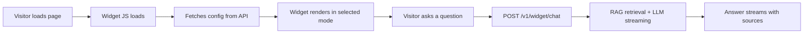

Add Ragora to any website with a single script tag. A widget key controls what the assistant knows and how it answers. Each install chooses how that key appears on the page.

Ragora supports 3 install modes:

- **Support** — floating assistant for product, pricing, and support pages
- **Ask AI** — search-style overlay for docs and app surfaces
- **Embedded** — inline assistant mounted into a page section

## Quick Start

### 1. Create a Widget Key

Open the Ragora dashboard and go to **Settings** → **Widget** (`/settings?tab=widget`).

Create a widget key with:

- **Name** — internal label for the assistant
- **Workspaces** — which workspaces it can search
- **Allowed Domains** — which sites can use the key
- **Prompt / behavior settings** — title, welcome message, escalation, retrieval settings

The widget key starts with `wk_`.

### 2. Pick an Install Mode

#### Support

```html
<script
  src="https://api.ragora.app/widget/ragora-chat.js"
  data-key="wk_your-key-here"
  data-mode="support"
  data-theme="light">
</script>
```

Use this for marketing sites, pricing pages, and support entry points.

#### Ask AI

```html
<button class="ask-ai-trigger">Ask AI</button>

<script
  src="https://api.ragora.app/widget/ragora-chat.js"
  data-key="wk_your-key-here"
  data-mode="search"
  data-trigger-selector=".ask-ai-trigger"
  data-shortcut="true"
  data-theme="light">
</script>
```

Use this for docs, dashboards, and knowledge surfaces where a search-style overlay is a better fit than a floating chat bubble.

#### Embedded

```html
<div id="docs-ai"></div>

<script
  src="https://api.ragora.app/widget/ragora-chat.js"
  data-key="wk_your-key-here"
  data-mode="embedded"
  data-target="#docs-ai"
  data-theme="light">
</script>
```

Use this when the assistant should live inside the page layout.

### 3. Customize In The Dashboard

The dashboard generates a basic embed snippet (Support mode) and lets you configure:

- Name
- Allowed Domains
- Collections (workspaces)
- Theme (Light / Dark)
- Position (Left / Right)
- Widget Title
- Welcome Message

:::note
Additional settings such as placeholder, suggested questions, system prompt, escalation URL/label, rate limits, daily message limit, and retrieval parameters (`top_k`, `temperature`) are configurable via the [Widget Key Management API](#widget-key-management) (`PATCH /v1/widget/keys/:id`) but are not yet exposed in the dashboard UI.
:::

## Script Attributes

| Attribute | Values | Default | Description |
|-----------|--------|---------|-------------|
| `data-key` | `wk_...` | required | Widget key to use |
| `data-mode` | `support`, `search`, `embedded` | `support` | Install mode |
| `data-theme` | `light`, `dark` | `light` | Base theme |
| `data-trigger-selector` | CSS selector | none | Required for `search` mode. Opens Ask AI from matching elements |
| `data-target` | CSS selector | none | Required for `embedded` mode. Mount target |
| `data-shortcut` | `true`, `false` | `true` in `search` | Enables Cmd/Ctrl + K for Ask AI |
| `data-persist` | `true`, `false` | `true` in `support` and `embedded`, `false` in `search` | Persist conversation state |
| `data-accent-color` | CSS color | theme default | Accent color for launcher, actions, and highlights |
| `data-font-family` | CSS font-family | system stack | Widget font family |
| `data-border-radius` | CSS size | `16px` | Surface corner radius |

Example with styling overrides:

```html
<script
  src="https://api.ragora.app/widget/ragora-chat.js"
  data-key="wk_your-key-here"
  data-mode="support"
  data-theme="light"
  data-accent-color="#0ea5e9"
  data-font-family="Inter, system-ui, sans-serif"
  data-border-radius="14px">
</script>
```

## Mode Guide

### Support

Best for:

- marketing sites
- pricing pages
- support portals
- lead capture flows

Behavior:

- floating launcher
- conversation persistence by default
- low-confidence escalation CTA
- compact assistant layout

### Ask AI

Best for:

- docs sites
- app sidebars and headers
- internal knowledge surfaces
- command-palette style AI entry points

Behavior:

- opens from a trigger element
- supports Cmd/Ctrl + K by default
- does not persist by default
- answer-first overlay with sources and follow-ups

### Embedded

Best for:

- help center pages
- docs sidebars
- account portals
- custom layouts where the assistant is part of the page

Behavior:

- mounts into a specific DOM target
- no floating launcher
- persistence enabled by default

## Domain Locking

Widget keys can be restricted to specific domains.

| Pattern | Matches |
|---------|---------|
| `example.com` | only `example.com` |
| `*.example.com` | subdomains like `docs.example.com` |

If a request comes from an unlisted domain, the widget returns `403 Forbidden`.

## How It Works



Under the hood:

1. The script loads and renders inside a **Shadow DOM** so page styles do not leak into the widget.
2. The widget fetches display settings from `GET /v1/widget/config`.
3. When a user asks a question, the widget sends `POST /v1/widget/chat` with the `X-Widget-Key` header.
4. The server validates the widget key, applies domain checks and rate limits, then runs the same RAG pipeline used by the API.
5. Answers stream back in real time.
6. Sources, follow-up questions, and low-confidence escalation metadata are attached to the final response.

## Framework Examples

### Next.js

```tsx
import Script from "next/script";

export default function RootLayout({ children }) {
  return (
    <html>
      <body>
        {children}
        <button className="ask-ai-trigger">Ask AI</button>
        <Script
          src="https://api.ragora.app/widget/ragora-chat.js"
          data-key="wk_your-key-here"
          data-mode="search"
          data-trigger-selector=".ask-ai-trigger"
          strategy="lazyOnload"
        />
      </body>
    </html>
  );
}
```

### React

```tsx
import { useEffect } from "react";

export default function App() {
  useEffect(() => {
    const script = document.createElement("script");
    script.src = "https://api.ragora.app/widget/ragora-chat.js";
    script.setAttribute("data-key", "wk_your-key-here");
    script.setAttribute("data-mode", "support");
    document.body.appendChild(script);

    return () => {
      document.body.removeChild(script);
    };
  }, []);

  return <div>My app</div>;
}
```

## Security

| Concern | How it is handled |
|---------|-------------------|
| Key visible in HTML | Widget keys are chat-scoped and limited to configured collections |
| Unauthorized domains | `Origin` is validated against allowed domains |
| Abuse | Per-key request rate limit and daily message cap |
| Collection access | Collection IDs are enforced server-side from the widget key |
| Billing | Usage is charged to the widget key owner account |
| Cookie issues | Widget auth uses the `X-Widget-Key` header only |

## API Reference

### Get Widget Config

```http
GET /v1/widget/config
X-Widget-Key: wk_your-key-here
```

Response fields include:

- `title`
- `placeholder`
- `welcome_message`
- `system_prompt`
- `collection_ids`
- `escalation_url`
- `escalation_label`
- `theme`
- `position`
- `daily_message_limit`
- `top_k`
- `temperature`
- `suggested_questions`

### Widget Chat

```http
POST /v1/widget/chat
X-Widget-Key: wk_your-key-here
Content-Type: application/json
```

```json
{
  "messages": [
    { "role": "user", "content": "How do I reset my password?" }
  ],
  "stream": true
}
```

The response is streamed over SSE and can include:

- answer text deltas
- sources
- follow-up questions
- low-confidence escalation metadata
- conversation and message IDs

### Widget Key Management

These endpoints use your regular authenticated dashboard session or API key, not the widget key.

| Method | Endpoint | Description |
|--------|----------|-------------|
| `POST` | `/v1/widget/keys` | Create a widget key |
| `GET` | `/v1/widget/keys` | List widget keys |
| `PATCH` | `/v1/widget/keys/:id` | Update widget key settings |
| `DELETE` | `/v1/widget/keys/:id` | Delete a widget key |

## Troubleshooting

### The widget does not appear

- Check the browser console for `[Ragora Widget]` warnings
- Make sure `data-key` is present and starts with `wk_`
- Verify the script URL is `https://api.ragora.app/widget/ragora-chat.js`

### Ask AI does not open

- Make sure `data-mode="search"` is set
- Verify `data-trigger-selector` matches an element on the page
- If using the shortcut, make sure `data-shortcut` is not set to `false`

### Embedded mode does not mount

- Make sure `data-mode="embedded"` is set
- Verify the target element exists before the script loads
- Check that `data-target` matches the page element exactly

### Origin not allowed

- Add the current hostname to the widget key allowed domains
- Include explicit dev hosts like `localhost` or `127.0.0.1` when needed

### Styles do not match the site

The widget runs inside a Shadow DOM. Use `data-accent-color`, `data-font-family`, and `data-border-radius` to match your brand.
