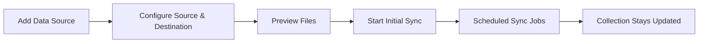

Cloud Connectors let you sync content from external data sources — documentation sites, code repositories, cloud storage — directly into a Ragora workspace on a recurring schedule. Once connected, your workspace stays up to date automatically as the source changes. Currently, the **Docs Website** connector (powered by Crawl4AI) is fully available for crawling documentation sites and web pages. Connectors for GitHub, Google Drive, Dropbox, S3, and Notion are coming soon.

## Connector Sync Lifecycle

---

## One-Time vs Recurring

| Goal | Use this path | Where |
|------|----------------|-------|
| Import GitHub content once | GitHub ingest tab | Workspace page |
| Keep source continuously synced | Connectors sync source | **Integrations** → **Data Sources** <a className="btn-inline" href="https://ragora.app/integrations?tab=sources">Data Sources &rarr;</a> |

If you only need a one-time import, see [Getting Started](/docs/getting-started) → Step 3C (GitHub Tab).

---

## What Connectors Support Right Now

When you click **Add Data Source**, a provider picker dialog opens. Current status of each provider:

| Provider | Status |
|----------|--------|
| **Docs Website** (Crawl4AI) | Available and fully functional |
| GitHub | Coming soon (shown in dialog but disabled) |
| Google Drive | Coming soon (shown in dialog but disabled) |
| Dropbox | Coming soon (shown in dialog but disabled) |
| Amazon S3 | Coming soon (shown in dialog but disabled) |
| Notion | Coming soon (shown in dialog but disabled) |

**Note:** Confluence does not appear in the provider picker at all.

Plan behavior:
- Data Connections are gated in UI for Free tier and intended for paid tiers.

---

## Full Setup: Docs Website (Crawl4AI)

This is the only fully functional connector in the current UI. It crawls a website and syncs its pages into a Ragora workspace.

### Step 1: Source Configuration

1. Go to **Integrations** → **Data Sources** <a className="btn-inline" href="https://ragora.app/integrations?tab=sources">Data Sources &rarr;</a>
2. Click **Add Data Source**
3. Select **Docs Website** from the provider picker
4. Enter the **Root URL** to crawl
5. Optionally configure URL **include/exclude patterns** to scope the crawl

### Step 2: Destination & Schedule

1. Select the **Destination** workspace
2. Choose **Frequency**: `daily`, `weekly`, or `monthly`
3. Choose **Content Type**: `software_docs`, `general`, `code`, `legal`, `medical`, or `financial`

### Step 3: Preview & Create

1. Click **Create & Preview**
2. Ragora opens a preview showing:
   - **Total files** discovered
   - **Estimated Size**
   - **New files** (not yet in workspace)
   - **Already synced** (dedupe count)
   - **File Types** breakdown
   - **Estimated duration**
   - **Sample items** from the crawl
   - **Warnings** (if any issues detected)
3. Review the preview and click **Start Sync**

**Note:** The sync strategy is always `mirror` — files deleted from the source are also removed from the workspace on the next sync. This is not a user-configurable option.

---

## Wizard Fields Reference

| Field | Values | Notes |
|------|--------|-------|
| Frequency | `daily`, `weekly`, `monthly` | Controls recurring sync cadence |
| Content Type | `software_docs`, `general`, `code`, `legal`, `medical`, `financial` | Influences processing/chunking profile |

---

## Provider-Specific Details

### Docs Website (Crawl4AI) — Available

Uses Crawl4AI to crawl and extract content from documentation sites and other web pages.

Configuration:
- **Root URL** — the starting page for the crawl
- **Include/Exclude patterns** — URL patterns to scope which pages are crawled
- Crawled pages are converted and ingested as documents into the destination workspace

### GitHub, Google Drive, Dropbox, S3, Notion — Coming Soon

These providers appear in the Data Sources dialog but are currently disabled with "Coming soon" labels. They will support recurring sync from their respective platforms when available.

---

## GitHub One-Time Import (Not Connectors)

Use this when you do not need schedules:

1. Open your workspace from **Workspaces** <a className="btn-inline" href="https://ragora.app/kb">Workspaces &rarr;</a>
2. Choose destination workspace
3. Open **GitHub** tab
4. Paste repo/folder/file URL
5. Optional filters:
   - token for rate limit headroom
   - docs-only
   - base path
   - include/exclude globs
6. Click **Fetch Files**
7. Click **Ingest**

This one-time path also supports repo-wide and folder-scoped ingest.

---

## Managing Existing Sync Sources

Each connected data source appears as a card on the Data Sources page. Available actions:

- **Sync Now**: trigger an immediate manual sync run
- **Remove**: delete the sync source

Schedule and status information (last/next sync, file counts) is shown on the source card.

---

## Troubleshooting

### Preview loads but shows zero files

Check:
- root URL is correct and publicly accessible
- include/exclude patterns are not filtering out all pages
- the website allows crawling (check robots.txt)

### Existing files not re-imported

Expected behavior:
- dedupe detects files already in collection
- preview shows already-synced count
- changed content updates according to sync pipeline

### Sync source not appearing after creation

Try:
- refresh the Data Sources page
- confirm the source was created successfully (check for error notifications)
